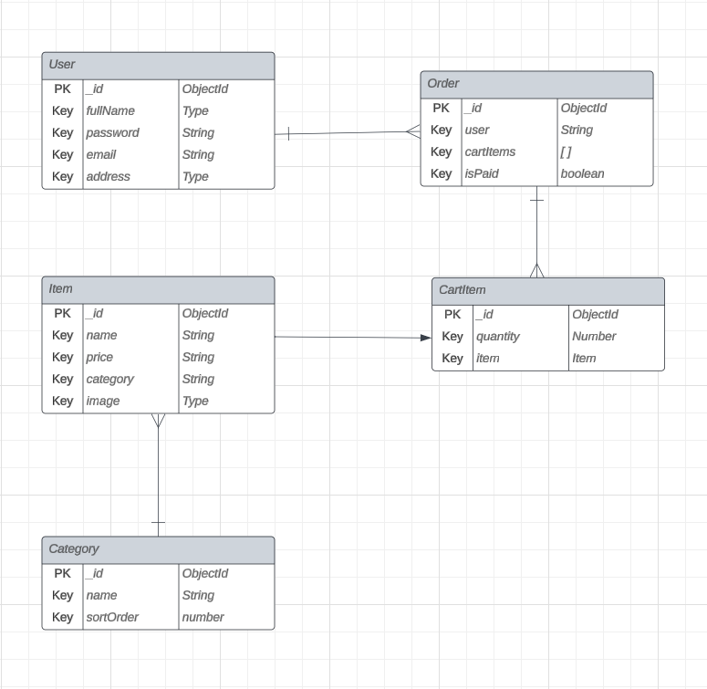

# CAKEHOLIC E-Commerce Web Application

Welcome to Cakeholic, a delightful e-commerce web application for a cake store. This project is designed to provide an enjoyable online shopping experience for cake enthusiasts. Whether you're craving a birthday cake or just a sweet treat, Cakeholic has you covered.

## Features

### User Authentication
Cakeholic ensures a secure environment for users with encrypted password. Users can create accounts, log in securely, and manage their personal information. This feature provides a personalized experience and allows users to track their order history.

### Shopping Cart
Enjoy a hassle-free shopping experience with our intuitive shopping cart feature. Users can easily add and remove items, update quantities, and proceed to checkout with confidence. The shopping cart is designed for efficiency and simplicity.

### Search and filter for Products
Find the perfect cake for any occasion with search functionality and category filter. Users can search for products based on titles within cake categories. This feature streamlines the shopping process and helps users discover their favorite cakes.

### User Profile
Cakeholic provides users with a dedicated profile section where they can manage their account details, view order history. This feature enhances the overall user experience and fosters a sense of personalization.

##  Screenshots
- SignUp/LogIn Page

- Home Page

- Shopping Page

- Cart Slider

- User Profile Page

## ERD 

## Getting Started
- [View the Project](https://cakeholic-5bde23339f90.herokuapp.com/) - You can access the live deployment of the Home Decorator web application to see it in action.
## Technologies Used

### Backend Software
- Node.js
- Express.js
- MongoDB
- JWT Authentication

### Frontend Software
- React.js
- Vite

### Security
- JWT for Authentication
- Bcrypt for password hashing

### Language Used
- Javascript
- HTML5

### Library Used for styling
- Tailwind CSS

## Next Steps
### Product Reviews and Ratings
Implement a user review and rating system to allow customers to share their experiences and help others make informed decisions.
### Payment Integration
Integrate a secure payment gateway such as Stripe to facilitate online transactions, providing users with a convenient and secure way to make purchases.
### User Profile Customization
Allow users to personalize their profiles by adding a profile image, editing and updating account information

